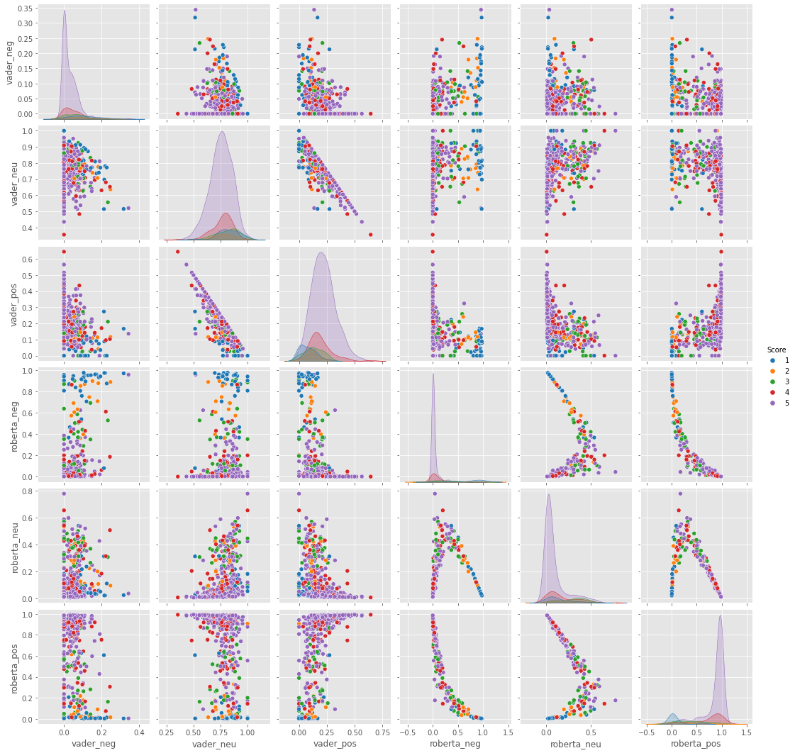

# **Sentiment Analysis [Amazon fine food reviews]**

## **1. Methodology**

I will be doing the comparison between VADER and Roberta Model for sentiment analysis

### VADER

VADER ( Valence Aware Dictionary for Sentiment Reasoning) is a model used for text sentiment analysis that is sensitive to both polarity (positive/negative) and intensity (strength) of emotion. It is available in the NLTK package and can be applied directly to unlabeled text data.

VADER sentimental analysis relies on a dictionary that maps lexical features to emotion intensities known as sentiment scores. The sentiment score of a text can be obtained by summing up the intensity of each word in the text.

For more details can [refer](https://towardsdatascience.com/sentimental-analysis-using-vader-a3415fef7664)

### Roberta Model

The RoBERTa model was proposed in RoBERTa: A Robustly Optimized BERT Pretraining Approach by Yinhan Liu, Myle Ott, Naman Goyal, Jingfei Du, Mandar Joshi, Danqi Chen, Omer Levy, Mike Lewis, Luke Zettlemoyer, Veselin Stoyanov. It is based on Google’s BERT model released in 2018.

It builds on BERT and modifies key hyperparameters, removing the next-sentence pretraining objective and training with much larger mini-batches and learning rates.

For more details can [refer](https://huggingface.co/docs/transformers/model_doc/roberta)

## **2. Description**

I will be doing some sentiment analysis in python using two different techniques:

1. VADER (Valence Aware Dictionary and sEntiment Reasoner) - Bag of words approach
2. Roberta Pertained Model from hugging face

## **3. Input / Output**

INPUT: A string which contains the amazon food review. It is either a positive statement or a negative statement.
OUTPUT: The model classifies the statement into positive, negative or neutral statement and returns the value.

## **4. Live link**

Link: [https://www.kaggle.com/sanchitbhadgal/sentiment-analysis](https://www.kaggle.com/sanchitbhadgal/sentiment-analysis)

## **5. Comparison**

